# Claude Copilot Webhook

An **opinionated workflow orchestration webhook** that replicates GitHub Copilot coding agent behavior using Claude Code GitHub Actions. This webhook automates issue-to-PR processes with the same workflow that GitHub Copilot coding agent provides.

## What This Solves

**Motivation:** GitHub Copilot coding agent has a really nice issue-to-PR workflow. This webhook replicates that exact behavior but uses [Claude Code GitHub Actions](https://github.com/etechlead/claude-code-action) (minimal fork) instead.

## Improvements Over Original Claude Code GitHub Actions

- 🎯 **Immediate Visual Feedback**: Adds 👀 (eyes) emoji reactions to issues, comments, and PR reviews so you get instant visual confirmation that something is processing your action
- 🔒 **Proper Isolation**: Automatically creates separate pull requests for each issue, isolating the coding agent's work in dedicated pull requests
- 🏷️ **Work-in-Progress Indicators**: Automatically adds `[WIP]` prefix to PR titles during work and removes it when complete
- 👤 **User Assignment**: Assigns the completed PR back to the originating user automatically
- ⚡ **Better UX**: In the end, improves interactivity, speed, visibility, and workflow isolation
- 🐛 **Fixes Review Comment Bug**: Collects all review comments and processes them in a single workflow run, preventing commit conflicts that occur in the original when each review comment triggers separate workflows that try to push conflicting commits

**Solution Components:**
- 🧠 **[Claude Code GitHub Actions](https://github.com/etechlead/claude-code-action)** (fork) - Customized AI coding actions
- ⚙️ **User's GitHub Workflow** - Custom workflow using the forked actions
- 🔧 **This Webhook** - Orchestrates the entire process automatically

## How It Works

**Issue → PR → Claude → Done**

1. **Label an issue** with `claude-copilot` → Webhook adds 👀 reaction + creates branch + draft PR + triggers your workflow
2. **Comment/review on PR** → Webhook adds 👀 reaction + routes to your workflow  
3. **Workflow completes** → Webhook assigns PR to you + removes `[WIP]` prefix + marks ready for review

```mermaid
flowchart TD
    A["👤 User labels issue<br/>with 'claude-copilot'"] --> B["🔧 Webhook detects event"]
    B --> C["👀 Add eyes reaction<br/>to issue"]
    C --> D["🌱 Create new branch<br/>from default branch"]
    D --> E["📝 Create draft PR<br/>with [WIP] prefix"]
    E --> F["🚀 Trigger GitHub workflow<br/>(Claude Code GitHub Actions)"]
    
    F --> G["🧠 Claude processes<br/>the issue"]
    
    H["💬 User comments/reviews<br/>on PR"] --> I["👀 Add eyes reaction<br/>to comment/review"]
    I --> J["🔄 Route feedback to<br/>GitHub workflow"]
    J --> G
    
    G --> K["✅ Workflow completes<br/>successfully"]
    K --> L["👤 Assign PR to<br/>original user"]
    L --> M["🏷️ Remove [WIP] prefix<br/>from PR title"]
    M --> N["🚀 Mark PR ready<br/>for review"]
    
    N --> O["🎉 Done!<br/>User can review and merge"]
    
    style A fill:#e1f5fe
    style O fill:#e8f5e8
    style G fill:#fff3e0
    style H fill:#f3e5f5
```



## How Components Work Together

This webhook orchestrates the complete workflow:

- **[Claude Code GitHub Actions](https://github.com/etechlead/claude-code-action)** (fork) 🧠 - Does the actual AI coding work
- **Your GitHub Workflow** ⚙️ - Uses the Claude Code GitHub Actions  
- **This Webhook** 🔧 - Orchestrates and automates the entire process

You need both [Claude Code GitHub Actions](https://github.com/etechlead/claude-code-action) (the fork) and a custom GitHub workflow configured in your repository. This webhook orchestrates the interactions to replicate GitHub Copilot coding agent behavior.

## Installation

1. **Set up [Claude Code GitHub Actions](https://github.com/etechlead/claude-code-action)** (fork) and custom GitHub workflow in your repository

   Create `.github/workflows/claude.yml` in your repository with this minimal configuration:

   ```yaml
   name: Claude Copilot
   run-name: "Claude Copilot - PR#${{ github.event.client_payload.pr_number }} - User:${{ github.event.client_payload.assignee_user }}" # required, format is parsed in the webhook
   on:
     repository_dispatch:
       types: [claude_copilot] # have to match the REPOSITORY_DISPATCH_EVENT in the webhook

   jobs:
     claude-code-action:
       runs-on: ubuntu-latest
       permissions:
         contents: write
         pull-requests: write
         issues: write
         id-token: write

       steps:
         - name: Checkout repository
           uses: actions/checkout@v4
           with:
             fetch-depth: 1

         - name: Run Claude Code Action
           uses: etechlead/claude-code-action@beta
           with:
             # Authentication for Anthropic API
             claude_code_oauth_token: ${{ secrets.CLAUDE_CODE_OAUTH_TOKEN }}
             
             # Token for working with GitHub API, obtained from your App
             github_token: ${{ github.event.client_payload.github_app_token }}
             
             # Example of allowed extra tools to use
             allowed_tools: "Bash"
   ```

   **Important notes:**
   - The `run-name` format is parsed by the webhook - don't change it
   - The `repository_dispatch` type must match your `REPOSITORY_DISPATCH_EVENT` config (default: `claude_copilot`)
   - You'll need to set the `CLAUDE_CODE_OAUTH_TOKEN` secret in your repository settings (see the [action documentation](https://github.com/etechlead/claude-code-action/tree/main?tab=readme-ov-file#manual-setup-direct-api)) or ANTHROPIC_API_KEY
   - For more configuration options and full documentation, see the [Claude Code GitHub Action docs](https://github.com/etechlead/claude-code-action)

2. **Create a GitHub App**:
   - Create a new GitHub App in your organization/personal account
   - **Webhook Configuration**:
     - Set webhook URL (use `https://smee.io` for development, cloud provider URL for production)
     - Generate and save a webhook secret
   - **Subscribe to Events**:
     - Issue Comment
     - Issues  
     - Label
     - Pull Request Review
     - Pull Request Review Comment
     - Workflow run
   - **Permissions** (Read & Write):
     - Actions
     - Contents
     - Issues
     - Pull Requests
   - **Generate and download private key** (save securely)
   - **Note the App ID** for configuration
   - **Install the app** into your repository (or all repositories)

3. **Deploy the webhook**:
   ```bash
   git clone <repository-url>
   cd claude-copilot-webhook
   bun install  # or npm install
   ```

4. **Configure environment variables**:
   ```bash
   cp .env.example .env
   # See Configuration section below to edit the .env
   ```

5. **Set up webhook delivery**:
   - **Development**: Use [smee.io](https://smee.io) to forward webhooks to your local development server
   - **Production**: Deploy to cloud provider (Vercel, Railway, Heroku, Cloudflare Workers, etc.) and update webhook URL in GitHub App

## Configuration

All configuration is done through environment variables. Copy `.env.example` to `.env` and configure with values from your GitHub App setup:

### Required Variables

- `APP_ID`: Your GitHub App ID (noted during GitHub App creation)
- `PRIVATE_KEY`: Your GitHub App private key in PEM format (the private key file you downloaded, with `\n` for line breaks)
- `WEBHOOK_SECRET`: Secret for webhook signature verification (generated during GitHub App creation)
- `TARGET_LABEL`: Label that triggers the workflow when applied to issues (default: `claude-copilot`).
- `DEFAULT_BRANCH`: Default branch for new PRs, usually your main branch (default: `main`)

### Optional Variables

- `BRANCH_PREFIX`: Prefix for automatically created branches (default: `claude/issue-`)
- `REPOSITORY_DISPATCH_EVENT`: Event name sent to trigger your GitHub workflow (default: `claude_copilot`).  Have to match the event name in your GitHub workflow file.
- `PULL_REQUEST_PREFIX`: Prefix added to PR titles to identify work-in-progress Claude-created PRs (default: `[WIP] `)
- `NODE_ENV`: Runtime environment - set to `production` for production deployments (default: `development`)
- `LOG_LEVEL`: Logging verbosity - use `debug` for troubleshooting, `info` for production (default: `info` in production, `debug` in development)

## Usage

### Development

```bash
# Start the development server with auto-reload
bun run dev

# Or with npm
npm run dev
```

### Production

```bash
# Start the production server
bun run start

# Or with npm
npm start
```

The webhook will be available at `http://localhost:3000` by default.

## Troubleshooting

Enable debug logging by setting `LOG_LEVEL=debug` in your environment variables.

Common issues:
- **Webhook not receiving events**: Check GitHub App webhook URL
- **Signature verification fails**: Verify `WEBHOOK_SECRET` matches GitHub App configuration
- **Permission errors**: Verify GitHub App has required repository permissions

## License

MIT 